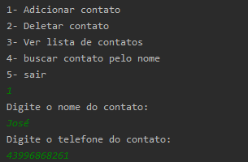
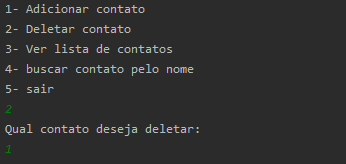
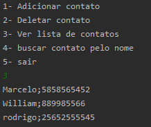
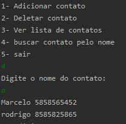
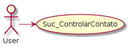
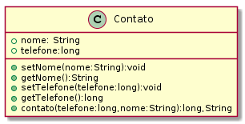
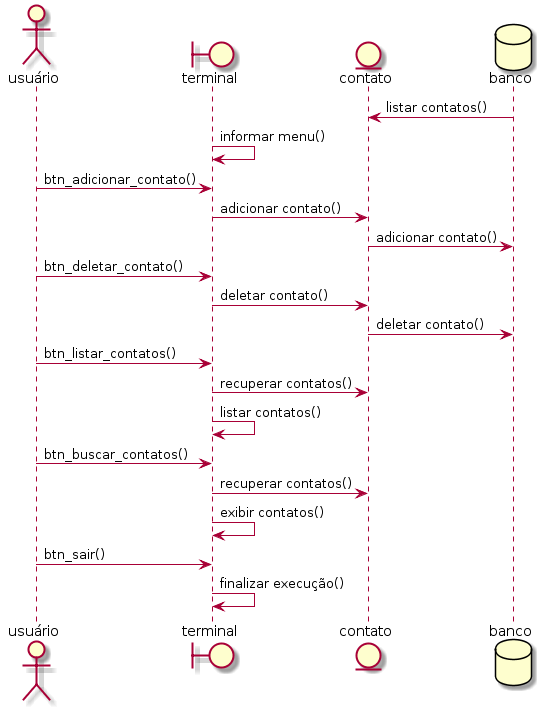

# Projeto Agenda Eletrônica

##Ao executar o projeto ele terá 4 funcionalidades

### 1-Adicionar um contato
A informação digitada pelo usuário é armazenada em um array assim um BufferWriter é inicializado e guarda os contatos no banco de dados

      

### 2-Deletar um contato
O usuário digita o número da linha do contato que gostaria que fosse deletado então é realizada uma busca no array de contatos,é localizado no mesmo e é removido,logo após outro BufferWriter inicializa e sobrescreve o banco de dados

      

### 3-Listar os contatos
Ele mostrará ao usuário todos os contatos que estão no banco de dados

      

### 4-Buscar contato
O usuário digitará o nome do contato ou parte do nome e o sistema mostrará os contatos que se encaixam no input

      

## Documentação

- Diagrama de Caso de Uso

      

- Diagrama de Classe

      

- Diagrama de Sequência

      

